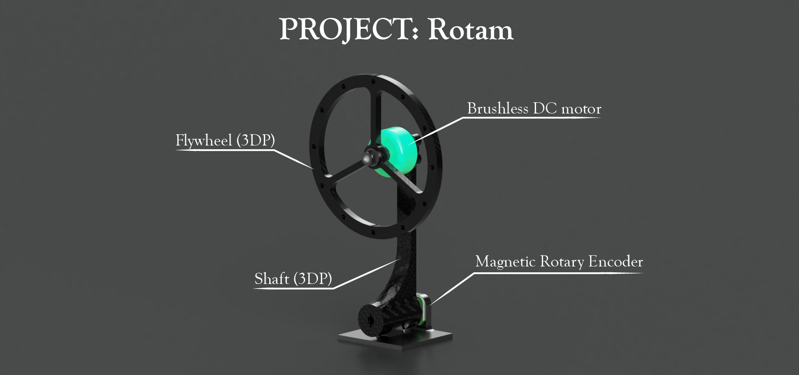

# Update
- My PC had an irrecoverable failure and all designs/backups were regrettably lost. The project is on indefinitely hold.

# Project-Ismus
Open source robotics -- hardware, software, and 3D design -- for controls education. Founded by myself, with gracious feedback from members of the [East Bay ML Meetup](https://www.meetup.com/East-Bay-Tri-Valley-Machine-Learning-Meetup/).

- **Key Values**
  - *Informative*: to complement the education process and feed curiosity
  - *Accesibility*: 3D-printable, with afforable electronic components
  - *Modularity*: to encourage exploration and customization

## Project Roadmap

- 2021
  - Early
    - [x] Finish 3D designs for 1-2 projects
  - Mid
    - Begin demo code for 1-2 projects
  - Late
    - Finish demo code for 1-2 projects
- 2022: 
  - Early
    - Finish 3D designs for remaining 3-5 projects
  - Mid
    - Finish demo code for remaining 3-5 projects

# Projects

## Rotam

- A twist on the classic inverted pendulum controls problem, featuring a reaction wheel

